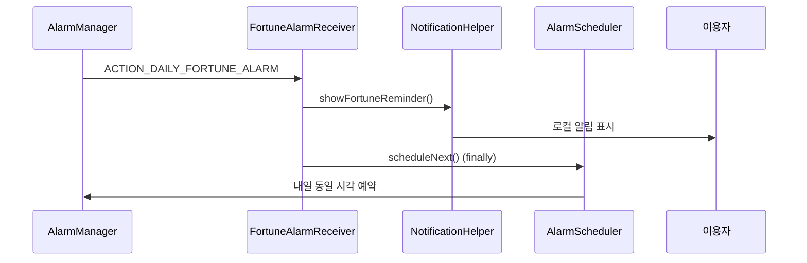
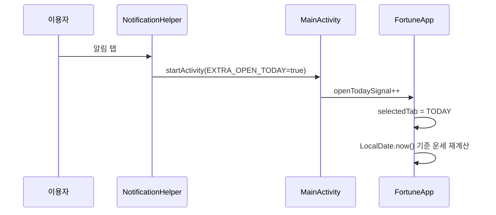
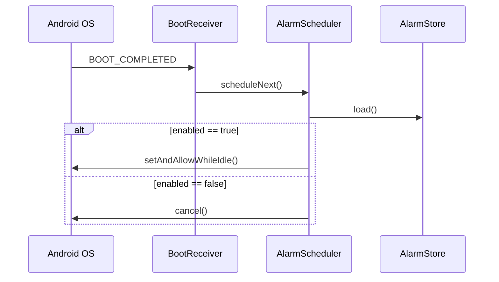

# 달빛운세 — 알림 기능 명세

> Android 앱(`com.dakbit.fortune`)에 구현된 **일일 운세 알림** 기능 정리 문서  
> 작성 기준: 현재 `main` 브랜치 소스

---

## 1. 개요

| 항목 | 내용 |
|------|------|
| 기능명 | 오늘의 운세 알림 |
| 목적 | 이용자가 설정한 시각에 매일 운세 확인을 유도 |
| 방식 | `AlarmManager` + `BroadcastReceiver` + 로컬 알림 |
| 네트워크 | 불필요 (오프라인 동작) |
| 기본 알림 시각 | 07:30 |
| 기본 상태 | 꺼짐(`enabled = false`) |

알림을 탭하면 **오늘 탭**으로 이동하며, 그 시점의 날짜 기준으로 운세가 다시 계산됩니다.

---

## 2. 사용자 UI (설정 화면)

설정 탭 하단 **「오늘의 운세 알림」** 카드에서 제어합니다.

### 2.1 제공 기능

- **켜기/끄기 스위치**
- **알림 시간 선택** (`TimePickerDialog`, 24시간 형식)
- 안내 문구:
  - 「설정한 시간 무렵에 알림을 보내드려요.」
  - 「알림을 누르면 오늘의 운세 화면으로 이동합니다. 소리와 진동은 휴대폰 설정을 따르며, 절전 상태에서는 조금 늦을 수 있습니다.」

### 2.2 알림 켜기 흐름

1. 스위치 ON
2. Android 13(API 33) 이상이면 `POST_NOTIFICATIONS` 권한 요청
3. 권한 허용 시 설정 저장 + 다음 알람 예약
4. 권한 거부 시 알림 설정은 OFF로 유지

### 2.3 알림 권한/차단 감지

다음 조건을 모두 만족해야 알림 ON 상태를 유지합니다.

- Android 13+ : `POST_NOTIFICATIONS` 권한 허용
- 시스템 알림 채널/앱 알림 허용 (`areNotificationsEnabled()`)

권한 또는 시스템 알림이 꺼지면 **자동으로 알림 설정을 OFF** 하고 저장합니다.

---

## 3. 아키텍처

### 3.1 구성 요소

| 클래스 | 역할 |
|--------|------|
| `AlarmStore` | 알림 ON/OFF, 시·분 설정을 `SharedPreferences`에 저장 |
| `AlarmScheduler` | `AlarmManager`로 다음 알람 시각 예약/취소, `BootReceiver` 활성화 관리 |
| `FortuneAlarmReceiver` | 알람 시각 도래 시 알림 표시 후 **다음 날 재예약** |
| `BootReceiver` | 부팅·시간·타임존 변경 후 알람 재등록 |
| `NotificationHelper` | 알림 채널 생성 및 알림 표시 |
| `MainActivity` | 앱 시작 시 채널 생성·알람 재등록, 알림 탭 시 오늘 탭 이동 |

### 3.2 파일 위치

```
app/src/main/java/com/dakbit/fortune/
├── AlarmStore.kt
├── AlarmScheduler.kt
├── FortuneAlarmReceiver.kt
├── BootReceiver.kt
├── NotificationHelper.kt
└── MainActivity.kt          # AlarmSettingsCard, 권한 처리

app/src/main/AndroidManifest.xml
app/src/main/res/drawable/ic_notification.xml
```

---

## 4. 데이터 저장

### 4.1 SharedPreferences

- 파일명: `dakbit_alarm`
- 키:

| 키 | 타입 | 기본값 | 설명 |
|----|------|--------|------|
| `enabled` | Boolean | `false` | 알림 사용 여부 |
| `hour` | Int | `7` | 알림 시 |
| `minute` | Int | `30` | 알림 분 |

### 4.2 데이터 모델

```kotlin
data class AlarmSettings(
    val enabled: Boolean,
    val hour: Int,
    val minute: Int,
)
```

---

## 5. 알람 스케줄링

### 5.1 예약 방식

- API: `AlarmManager.setAndAllowWhileIdle(RTC_WAKEUP, triggerAt, pendingIntent)`
- Intent Action: `com.dakbit.fortune.ACTION_DAILY_FORTUNE_ALARM`
- PendingIntent Request Code: `1001`
- Flags: `FLAG_UPDATE_CURRENT | FLAG_IMMUTABLE`

`setAndAllowWhileIdle`을 사용해 Doze/절전 모드에서도 알람이 동작하도록 했습니다.  
다만 OS 정책상 **정확한 시각보다 다소 지연**될 수 있으며, UI 안내 문구에도 이를 명시합니다.

### 5.2 다음 알람 시각 계산

1. 기기 타임존(`ZoneId.systemDefault()`) 기준 현재 시각 조회
2. 오늘 `{hour}:{minute}:00` 구성
3. 이미 지난 시각이면 **내일** 같은 시각으로 설정
4. epoch millis로 변환해 예약

### 5.3 재예약 시점

| 시점 | 동작 |
|------|------|
| 알림 ON / 시간 변경 | `AlarmScheduler.scheduleNext()` |
| 알림 OFF | `AlarmScheduler.cancel()` |
| 알람 수신 (`FortuneAlarmReceiver`) | 알림 표시 후 `scheduleNext()` (다음 날) |
| 앱 실행 (`MainActivity.onCreate`) | enabled이면 `scheduleNext()` |
| 부팅 완료 | `BootReceiver` → `scheduleNext()` |
| 시스템 시간 변경 | `BootReceiver` → `scheduleNext()` |
| 타임존 변경 | `BootReceiver` → `scheduleNext()` |

### 5.4 BootReceiver 활성화 전략

- Manifest에서 `BootReceiver`는 기본 **`android:enabled="false"`**
- 알림이 켜질 때만 `PackageManager.setComponentEnabledSetting(..., ENABLED)` 로 활성화
- 알림이 꺼지면 다시 비활성화

→ 알림을 쓰지 않는 사용자에게 불필요한 부팅 수신을 막습니다.

---

## 6. 알림 표시

### 6.1 알림 채널

| 항목 | 값 |
|------|-----|
| Channel ID | `fortune_daily` |
| 이름 | 오늘의 운세 알림 |
| 설명 | 설정한 시간 무렵에 오늘의 운세를 알려드립니다. |
| 중요도 | `IMPORTANCE_DEFAULT` |

Android 8.0(API 26) 이상에서 `NotificationHelper.ensureChannel()`로 생성합니다.

### 6.2 알림 내용

| 항목 | 값 |
|------|-----|
| Notification ID | `2001` |
| Small Icon | `@drawable/ic_notification` (흰색 초승달+별, 단색) |
| 제목 | 달빛 운세 |
| 본문 | 오늘의 운세가 도착했어요. 확인해 보세요. |
| Priority | `PRIORITY_DEFAULT` |
| Auto Cancel | `true` |
| 소리/진동 | 시스템 알림 설정 따름 (앱에서 별도 지정 없음) |

### 6.3 알림 탭 동작

1. `MainActivity`를 `EXTRA_OPEN_TODAY = true` 와 함께 실행
2. `FortuneApp`에서 `openTodaySignal` 증가 감지
3. 하단 탭을 **오늘** 탭으로 전환
4. `onResume()` 시 `resumeTick` 증가 → `LocalDate.now()` 재계산 → **당일 운세 갱신**

앱이 이미 실행 중이면 `onNewIntent()`에서 동일하게 처리합니다.

---

## 7. 권한 (AndroidManifest)

```xml
<uses-permission android:name="android.permission.POST_NOTIFICATIONS" />
<uses-permission android:name="android.permission.RECEIVE_BOOT_COMPLETED" />
```

| 권한 | 용도 |
|------|------|
| `POST_NOTIFICATIONS` | Android 13+ 알림 표시 |
| `RECEIVE_BOOT_COMPLETED` | 재부팅 후 알람 재등록 |

---

## 8. 예외 처리 및 제약

### 8.1 알림 표시 실패

- Android 13+에서 권한 없으면 `showFortuneReminder()` → `false` 반환
- `SecurityException` 발생 시 catch 후 `false` 반환
- **알림 표시 실패와 관계없이** `FortuneAlarmReceiver`는 `finally`에서 다음 날 알람을 재예약

### 8.2 알림 권한/시스템 차단

- 설정 화면 `LaunchedEffect`가 감지하면 알림 설정 자동 OFF

### 8.3 OS 제약

- Doze, 배터리 절약, 제조사별 백그라운드 제한으로 알람·알림이 지연될 수 있음
- `setExact()` / `SCHEDULE_EXACT_ALARM` 권한은 **사용하지 않음** (inexact idle 알람)

### 8.4 미구현 / 범위 외

- 알림 본문에 운세 점수·한 줄 요약 미포함 (고정 문구만 표시)
- 반복 알림(RRULE) 미사용 — 매번 1회 예약 후 수신 시 다음 1회 재예약
- 서버 푸시(FCM) 없음
- WorkManager 미사용

---

## 9. 동작 흐름도

### 9.1 일일 알림 발화



### 9.2 알림 탭 → 오늘 운세



### 9.3 재부팅 후 복구



---

## 10. 테스트 체크리스트

- [ ] 설정에서 알림 ON → 권한 허용 → 지정 시각 알림 수신
- [ ] 알림 탭 → 오늘 탭 이동 및 당일 운세 표시
- [ ] 알림 OFF → 예약 취소, 이후 알림 미수신
- [ ] 시간 변경 → 변경된 시각에 알림
- [ ] 권한 거부 → 알림 설정 자동 OFF
- [ ] 시스템 설정에서 앱 알림 차단 → 앱 재진입 시 알림 OFF
- [ ] 재부팅 후 enabled=true이면 알람 유지
- [ ] 자정 경과 후 알림 탭 시 새 날짜 운세 표시

---

## 11. 관련 코드 참조

| 동작 | 파일 |
|------|------|
| UI·권한 | `MainActivity.kt` → `AlarmSettingsCard()` |
| 설정 저장 | `AlarmStore.kt` |
| 알람 예약 | `AlarmScheduler.kt` |
| 알람 수신 | `FortuneAlarmReceiver.kt` |
| 부팅/시간 복구 | `BootReceiver.kt` |
| 알림 생성 | `NotificationHelper.kt` |
| 매니페스트 | `AndroidManifest.xml` |
